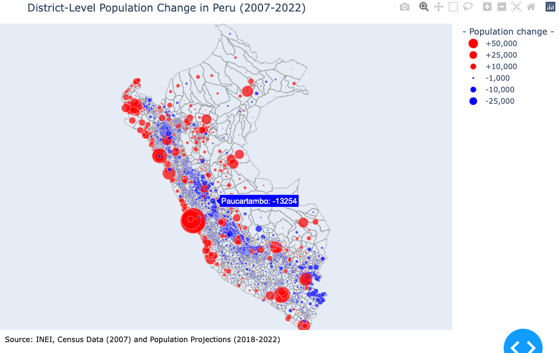

# District-Level-Population-Trends-in-Peru
This repository contains a Dash-based interactive dashboard that visualizes district-level population change in Peru (2007-2022). The data is sourced from the 2007 Census and Population Projections (2018-2022) by INEI. The map highlights demographic shifts and provides insights into population growth and decline across districts. Districts are represented as polygons, and their population difference is shown using color-coded, size-scaled markers at their geographic centroids.


## Overview

- **Framework**: Dash (Plotly)
- **Mapping library**: Plotly Graph Objects + GeoPandas
- **Data sources**:
  - `data.xlsx`: Excel file with population difference (`cp_dif`) and `ubigeo` identifiers
  - `DISTRITOS_inei_geogpsperu_suyopomalia.shp`: Shapefile of Peruvian districts
- **Output**: Interactive web-based map visualizing district-level population changes

## Features

- Polygon rendering of Peruvian districts using shapefiles
- Centroid-based markers scaled and colored by population difference (`cp_dif`)
  - Red: population increase
  - Blue: population decrease
- Custom legend to interpret marker sizes
- Hover tooltips with district names and values
- Annotations with data source info

## Requirements

Install required Python packages:

```bash
pip install dash pandas geopandas plotly openpyxl
```

## File Structure

- `app.py` (or similar): Main Dash application script
- `data.xlsx`: Contains `ubigeo`, `cp_dif`, and `distrito`
- `DISTRITOS_inei_geogpsperu_suyopomalia.shp` + associated shapefile files

## Running the App

Run the app locally:

```bash
python app.py
```

The app will be available at [http://localhost:8050](http://localhost:8050)

## Customization

- You can modify the `scale_factor` to adjust marker sizes.
- The legend categories can be edited to reflect different population thresholds.
- The color scheme (currently red/blue) can be adapted to suit other contexts.

## Notes

- The CRS (Coordinate Reference System) is converted to EPSG:3857 to ensure accurate centroid calculation and rendering.
- The application is designed for district-level comparison only; department-level aggregation is not currently supported.

## Acknowledgements

- INEI: Instituto Nacional de Estadística e Informática (Census and projections data)
- GeoGPSPeru for shapefile distribution
- Dash and Plotly for open-source visualization tools

## License

This project is open source and available under the MIT License.

## Output




